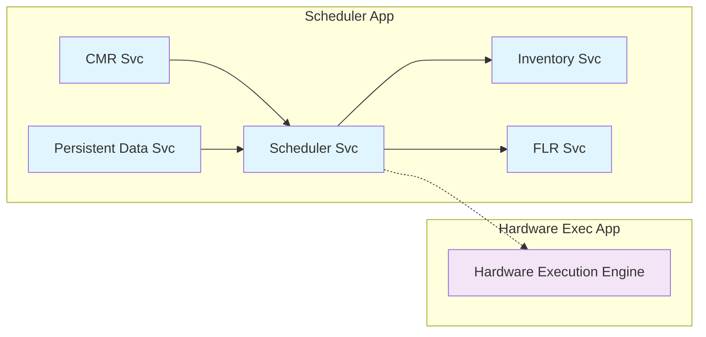
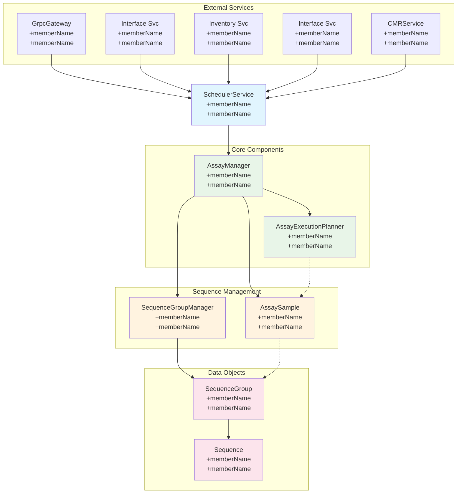

# Software Design

The following sections outline the main design points of the system for the CMR/Assay drop.

The Scheduler application components interact with themselves and with the Hardware Execution Application [HEA], specifically, with the hardware execution engine. The following diagram schematically presents the main components and structures discussion with this System Design.

*Figure 2 High-Level Software Design*

## 1. Scheduler Application

Container for all Scheduler based services.

## 2. CMR Service

The CMR Service supports the execution of Custom-Made Runs, a data input mechanism which allows the injection to the device of an arbitrary set of test orders to run. The CMR technique is used primarily for research and development and for other standing configurations of the device. It is an alternative pathway to the nominal tests that are driven by Pharos messaging and subsequent Quality Control (QC)/Curve Control (CC)/Calibration (Cal)/Blank rules.

The CMR Service has the following components to support CMR execution:

1. File Management
2. File Parsing
3. Test Order Instantiation
4. Loading AssayManager

### 2.1 File Management

Supported by the CLI CMR command LoadFile, the CMR Service allows for the uploading of CMR files to a known CMR Library location on the device's controlling computer.

### 2.2 File Parsing, Test Order Instantiation, and the AssayManager

Supported by the CLI CMR command PrepareFile, the CMR Service loads the given file from the CMR Library into memory and then parses the content into interim data objects, and then loads the AssayManager with AssaySamples and then uses the AssayManager to interact with he Inventory Service to check that is enough inventory for all proposed tests in the CMR file.

If there is enough inventory (articles covering all aspects of consumables necessary for the complete running of all tests), the end users if given the go ahead to issue the CLI CMR command Execute. If not, the end user is informed by message back to their console that there are missing the following articles and prompted to fix and re-execute the Prepare command.

The CLI CMR command Execute performs the same actions and then begins the actual processing of tests through the device by means of the AssayManager component's normal functioning.

## Out of Scope

- Design and implementation of communication with Pharos
  - The Comms spec should be **considered** during design of the Scheduler, but the prescribed communication sequences should not be worked on
- Optimization of scheduling algorithms (just need "good enough" to meet Systems timing needs)
- Implementation of nominal test order processing (from Pharos)
- Design and implementation of QC/Cal/CC/Blank processing rules
- Error recovery
  - What DO we do? Ask Systems what we do when there is a step loss etc. [@Mann, David](https://tf-project.kmc.elbitsystems-us.com/Default/Tetris/_backlogs/backlog/Software%20Team%20Porter/Features/?workitem=11776)
  - [@Smith, Aaron (US)](https://tf-project.kmc.elbitsystems-us.com/Default/Tetris/_backlogs/backlog/Software%20Team%20Porter/Features/?workitem=11776) we need to discuss more with Phadia because based on Mikael's response in the drop description doc, we are not aligned on this
- Error reporting to external clients
  - Just log and fail (TBD what fail means) the CMR if error is detected (see Description section)
- State machine design and implementation beyond what is necessary to maintain **internal** state
  - No concern should be made for any Comms spec definition of state
- Automated maintenance (rinse, etc.)
- Test methods and articles
  - All reagent information will be dictated by the CMR file

## 3. Data Persistence Service

### 3.1 Overview

The Instrument.Scheduling.Data project implements a data access layer for instrument scheduling operations. Built with .NET 8.0 and Entity Framework Core 9.0, it provides a foundation for storing, retrieving, and managing the entities required for scheduling operations on the Tetris platform.

### 3.2 Core Architecture

The project follows a clean, domain-driven design approach with these key architectural components:

- **Immutable Domain Entities**: C# record types ensure thread-safety and data integrity
- **Repository Pattern**: Generic and specialized repositories abstract data access details
- **Storage Provider Strategy**: Currently supports two storage providers, SQLite and SQL Server. The ability to import/export the database to Json files is also supported.
- **Service Layer**: Domain services implement business logic not contained in entities

Additional data layer features including initialization, migration, and typical configuration options are also available.

### 3.3 Domain Model

The data layer defines a rich domain model centered on these core entities:

- **Sequence**: Represents a discrete operation performed by the instrument
- **Parameter**: Configurable values used by sequences
- **SequenceGroup**: Ordered collections of sequences that define test procedures
- **Resource**: Physical or logical resources required for sequence execution
- **Range & RangeValue**: Define valid value constraints for parameters

### 3.4 Repository Implementation

Repositories implement standard operations (GetById, GetAll, GetQueryable, Add, Update, Delete) with specialized extensions per entity type.

### 3.5 Storage Providers

The project implements distinct storage providers:

1. **SQLite Provider**: Local database storage with EF Core
   - Full relational model with defined relationships
   - Suitable for standalone applications

2. **SQL Server Provider**: Enterprise-grade storage for production environments
   - Same EF Core model as SQLite but optimized for SQL Server

The provider strategy allows switching storage implementations without changing application code.

### 3.6 Service Layer

Domain services implement business logic beyond basic CRUD operations.

## 4. Scheduler Service

The Scheduler Service handles all the key interactions for running and reporting tests, both from Pharos and from CMR-s, as well as managing some device operations.

The following calls out the key components of the Scheduler Service:

### 4.1 SchedulerService

The SchedulerService handles all requests for tests from Pharos, reporting requests, and handles all device-oriented activities by way of loading device SequenceGroup instances directly into the SequenceGroupManager for execution. Provides high-level control of the SequenceGroupManager and AssayManager components.

The SchedulerService is the heart of the Scheduler Application. The following are its main sub-components:

1. AssayManager
2. SequenceGroupManager
3. AssayExecutionPlanner
4. CmrService
5. GrpcGateway
6. IFlrAssayRunContext

### 4.2 Assay Manager Component

The AssayManager handles all sample assays in-flight, scheduled, blocked, and errored.

#### 4.2.1 AssayManager

- Has a dictionary of AssaySample objects
  1. Can CRUD AssaySample object instances
  2. Can manage lifetime of AssaySample object instances
  3. Can subscribe to AssaySample lifetime events
  4. Removes AssaySample instances that are completed or errored

- Has 4 main sub-components
  - AssayExecutionPlanner component: instantiated on AssayManager startup and creates the AssayExecutionPlan
  - SequenceGroupManager component: instantiated on AssayManager startup and tracks the SequenceGroup correlates on in-flight tests
  - GrpcGateway component: instantiated on AssayManager startup and provides configuration and event management services with the HEA
  - IFlrAssayRunContext component: DI instance injected on AssayManager startup and provides a factory IFlrSampleTestContext instances

3. Maintains the current AssayExecutionPlan in conjunction with the AssayExecutionPlanner component
   - The AssayExecutionPlan functions as the total, ordered set of Assays within the system holding record of
     1. the in-flight tests,
     2. the tests within the QC domain that must be run together,
     3. the tests to be run,
     4. the tests that cannot be run for lack of inventory, and,
     5. the tests that are errored out
   - All Assays are held in the AssaySample-s collection(/dictionary)

4. Can process a SampleInformation object from Pharos and break out all sample test orders into replicate-based AssaySample-s, i.e., test orders will have N replicates that are parsed out into N AssaySample instances.

5. Can report out the AssayExecutionPlan to Pharos whenever requested

6. Can recalculate the AssayExecutionPlan whenever new or updated Assays become available

7. Can process the AssayExecutionPlan and provide the SequenceGroupManager component fully hydrated SequenceGroup-s for each AssaySample processed with configuration support from the Data Persistence Service
   - To support CMR Sequence parameter overrides, newly instantiated SequenceGroup-s must be available to the CMR Service when the CMR service is processing a CMR

8. There is a one-to-one correlation between am AssaySample and a SequenceGroup when the SequenceGroup represents a test in the device

9. Implement a singleton instance of the AssayManager in the Scheduler Application

10. Receives an instance of the IFlrContextFactory from Dependency Injection [DI] at AssayManager initialization

11. Uses the IFlrContextFactory to receive an IFlrAssayRunContext object.

12. Uses the IFlrAssayRunContext object to mark the beginning and the ending of an Assay Run

13. Uses the IFlrAssayRunContext to retrieve an IFlrSampleTestContext object for use in reporting to the FLR HAL data events received back from the GrpcGateway

#### 4.2.2 SequenceGroupManager

- The SequenceGroupManager tracks SequenceGroup-s hydrated for each of the in-flight AssaySample-s the AssayManager is managing
  1. Can CRUD SequenceGroup object instances
  2. Can manage lifetime of SequenceGroup object instances
  3. Can subscribe to SequenceGroup lifetime events
  4. Removes SequenceGroup instances that are completed or errored

#### 4.2.3 AssayExecutionPlanner

- The AssayExecutionPlanner holds the list of requested Assays(test orders) and device actions[^1]
- The AssayExecutionPlanner can create an AssayExecutionPlan for the AssayManager to process

#### 4.2.4 CmrService

#### 4.2.5 GrpcGateway

#### 4.2.6 IFlrAssayRunContext

### Supporting classes for the ScheduleManager

#### 4.2.7 AssaySample

- Has IdKey that is autogenerated
- Knows what kind of test it is and configures accordingly
- Has a SequenceGroup object when activated for in-flight processing
- Has an IFlrSampleTestContext object when activated for in-flight processing

#### 4.2.8 IFlrSampleTestContext

### 4.3 Assay Execution Planner Component

Creates the Assay Execution Plans for the AssayManager

1. Called by the AssayManager.
2. Is used to process all AssaySample-s and create an AssayExecutionPlan instance

### 4.4 Sequence Group Manager Component

Responsible for all in-flight SequenceGroups and working with the Hardware Execution planner to utilize the hardware execution plan.

#### 4.4.1 SequenceGroupManager

- Has dictionary of SequenceGroup objects
- Can add SequenceGroup object instances
- Can manage lifetime of SequenceGroup object instances
- Can subscribe to SequenceGroup lifetime events
- Can remove SequenceGroup instances that are completed or errored
- Can call the AssayManager when a SequenceGroup is finished
- Creates and maintains the current HardwareExecutionPlan
- Can process the HardwareExecutionPlan Sequence by Sequence and provide the hardware execution engine Sequences to execute
- For each SequenceGroup, be able to decompose the constituent Sequence-s and arrange them into an overall HardwareExecutionPlan that aligns with the device actions necessary to support processing of the sample

#### 4.4.2 SequenceGroup

- Has and IdKey that is autogenerated
- Knows when it is done

#### 4.4.3 Interactions between SequenceGroupManager and the Execution Engine

1. The scheduler will send an execution request for forward ticks to the execution engine. This is an orthogonal request, for the future time period, across multiple hardware components.

2. The scheduler will get a request identifier back from the Execution Engine.

3. The scheduler will then open a gRPC request channel to get updates regarding the sequences for the execution request.

4. Once a success/ failure is received, then the scheduler is able to schedule the next sequence, for the appropriate period.

5. Assays that have earlier sequence failures need not be executed in future periods

### 4.5 Hardware Modeling Component

Responsible for representing the current state of the hardware. Design in progress with prototyping.

### 4.6 FLR Integration Component

Integrates with the FLR functionality

### 4.7 Scheduler State Machine Component

The Scheduler has a state machine that allows for business rules and operational conditions to be modeled and managed.

### 4.8 HAL Events Integration

Integrates Scheduler with HAL events for Steady-State and Out-of-Range conditions and represents the first business rule within the system.

**Business Rule: Core Environment**

#### 4.8.1 States

- **Initialized**: Initial state. No processing may occur until a Steady-State event is received from the HAL layer; this state must be set during the start up routines at minimum; the timer clock is reset and inactivated.

- **Steady-State**: Event received from the HAL layer signaling that test process may occur

- **Out-of-Range**: Event received from the HAL layer signaling that the Core environment is outside of allowed tolerances

- **Invalid-Tests**: Event received from the timer clock for this business rule

#### 4.8.2 Conditions

- Scheduler begins activation in the Initialized state when so set
- If a Steady-State event is received, the state machine transitions to Steady-State and test processing may be done; if the prior state was Out-of-Range, the timer clock is stopped and is reset and inactivated
- If an Out-of-Range event is received, the state transitions to Out-of-Range and the timer clock is activated
- If 8 minutes[^2] elapses on the timer clocker, the timer clock signals a Invalid-Test event
- If and Invalid-Tests event is received, all processing must stop and all in flight tests are invalidated; no further processing may occur until the state machine is reset to Initialized.

## 5. Inventory Service

Manages System Inventory of all Articles. Data will be managed in a database.

**NB**: tracking needs to ALSO be done for things like expiry, open for access, etc.

The domain model for the Inventory Service

1. Should include all article interfaces
   - Stub out minimum POCO type attributes only

2. Should include service with three function calls
   - InventoryReserve<T>()
   - InventoryRelease<T>()
   - InventoryUpdate<T>(<T> valuesAdded)
   - InventoryHas<T>()

3. Provide dummy service implementation that affirms inventory is present for CMR

## 6. CLI CMR Commands

Implement the four main CLI commands

### 6.1 CLI CMR LoadFile[^3]

1. The CLI should be able to upload a file from a local environment to a known library folder on the ISW machine. The command should return a message indicating success or failure.

### 6.2 CLI CMR Prepare

- All AssaySample objects should be added to the AssayManager
- All AssaySample-s should be evaluated by running through the inventory service to determine that there is enough inventory of articles to run the AssaySample-s
- The environment should be in Steady-State
- Once a review is conducted, if there are any errors the user should be notified of the type of errors
- If everything passes, the user is notified that they may begin execution

### 6.3 CLI CMR Execute

- Do one final prepare check
- If not pass, inform user
- if pass, the execution of CMR should begin
- This should invoke the normal processing for the creation of the AssayExecutionPlan, the HardwareExecutionPlan
- Once the execution plans have been calculated, the processing of sample will begin.

### 6.4 CLI CMR Abort

- Stop all processing
- All memory objects are zeroed out
- Execute clean up procedures if The Execute command has been given.

## 7. Configuration

All configurations will be maintained preferentially in database storage, and, secondarily in JSON-based configuration files.

## 8. Data Flow

Data (test orders) flow into the Scheduler in two ways: 1) from Pharos requests, and, 2) from processing Custom-Made Runs [CMR-s], which are manually loaded into the system and initiated through the command console and the Command-Line Interface [CLI]. For the Pharos-based requests, the Scheduler receives input through the main ISW Gateway[^4]. For CMR-s, The Scheduler receives input from the CMR Service.

When a CMR is begun, the CLI CMR commands are used to load, prepare, execute, and, potentially, abort a run. CMR-s are embodied in specially formatted CSV files delineated using semicolons[^5]. In these files, there are two sections: parameters and test orders[^6]. In general, test orders are read from each row in the test orders section. The delimited logical columns for each row are determined by the first row in the test orders section where each column is given a header name that corresponds to one of fields in the constellation of possible fields that can be supplied to the CMR processor. The CMR service reads and parses the file data to create a set of CMR Assay objects.

Once the CMR is processed for all test orders, the CMR assay objects are converted to AssaySample objects with help form and added to the AssayManager and its AssaySamples collection. At this point, the Inventory Service is checked for sufficient resources to run each of the attendant tests. If there are not enough resources, the end user is notified to allow for correction. The end user will need to issue a prepare command again. If there are enough resources, the end user is notified that they may continue by issuing the execute command.

When the execute command is issued by mean of the CLI CMR Execute command, one final inventory check is done and then the system begins to process the CMR.

When the system begins processing, the AssayManager connects with the AssayExecutionPlanner component. The AssayManager provides a reference to the AssaySample collection, which is then processed by the AssayExecutionPlanner. The output of that processing is an AssayExecutionPlan, which is returned to and stored by the AssayManager. The AssayExecutionPlan is an optimized listing of tests to be performed. When the AssayManager is ready to begin test processing, it takes each AssaySample and hydrates that assay sample into a SequenceGroup representing the type of test to run. It does this hydration in conjunction with the Data Persistence Service. The resulting SequenceGroup-s are composed of individual Sequence-s that are necessary to run the test through the Core of the device. The AssayManager then connects with the SequenceGroupManager and begins providing hydrated SequenceGroup-s, in the order of the AssayExecutionPlan, to the SequenceGroupManager for processing.

The SequenceGroupManager begins activation by connecting by gRPC to the HardwareExecutionEngine to listen for Sequence completion and error events. Any Sequences sent to the Hardware Execution Engine will be correlated to the error or completion events as appropriate. Once all the Sequence-s in a SequenceGroup have been executed, the SequenceGroupManager will inform the AssayManager of that status for the in-flight AssaySample represented by that SequenceGroup.

Whenever the SequenceGroupManager receives a set of SequenceGroup-s to execute, it creates an optimized ordering of Sequences and stores that ordered HardwareExecutionPlan. When the SequenceGroupManager stores the HardwareExecutionPlan, it begins feeding the ordered sequences to the Hardware Execution Engine[^7].

As sequences are processed, processing events will be passed up to the SequenceGroupManager where key information about given sequences will be processed and passed up to the attendant AssaySample to track the ongoing accumulation of data about the test and for its reporting out to Pharos[^8] and the FLR.

Finally, when the AssayManager receives event notification of the end of processing for any in-flight AssaySample, the AssayManager will call out to the FLR Service and provide a data transfer object to convey all information about that AssaySample processing.

---

## Footnotes

[^1]: Device actions are actions not directly related to a given test order/Assay but that are part of the scheduling and operational needs of the device as a whole

[^2]: Configuration please

[^3]: Call it AddFile Check out the scripting DB as model

[^4]: This is out of scope for the Assay/CMR software drop.

[^5]: These CMR CSV files are typically supplied as Excel spreadsheets.

[^6]: For full details, see reference [9] (P2137 Tetris CMR File Format Description, 787899 V0.8 (WIP - draft).docx)

[^7]: See Section 3.4.3 above for interaction descriptions.

[^8]: Pharos reporting through the CommSpec protocols will not be supported for the CMR/Assay drop

---

*From <https://kmcsystems.sharepoint.com/sites/Tetris/Shared%20Documents/Software/3-Design%20Output/Design%20Desc%20Doc/Instrument%20Controller/Scheduler%20Application/Working/Instrument%20Controller%20Scheduler%20Application%20Design%20Document.docx>*